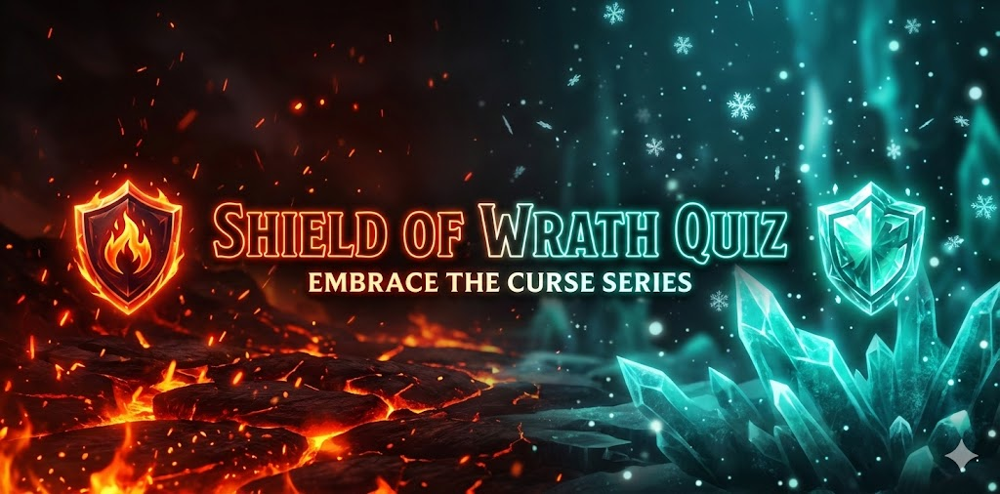
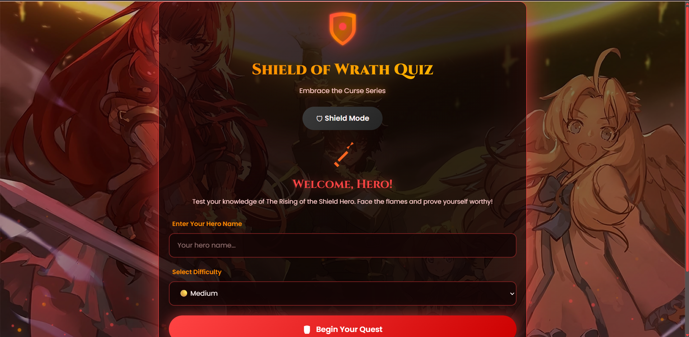
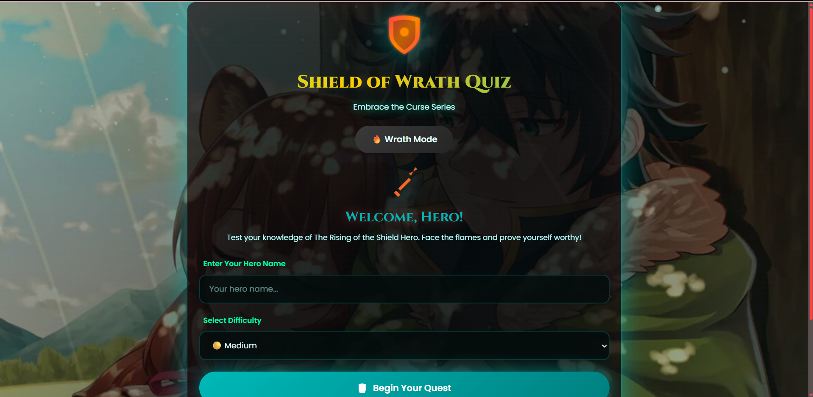
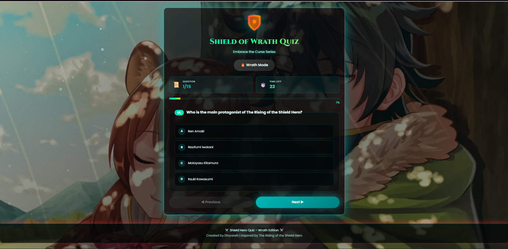
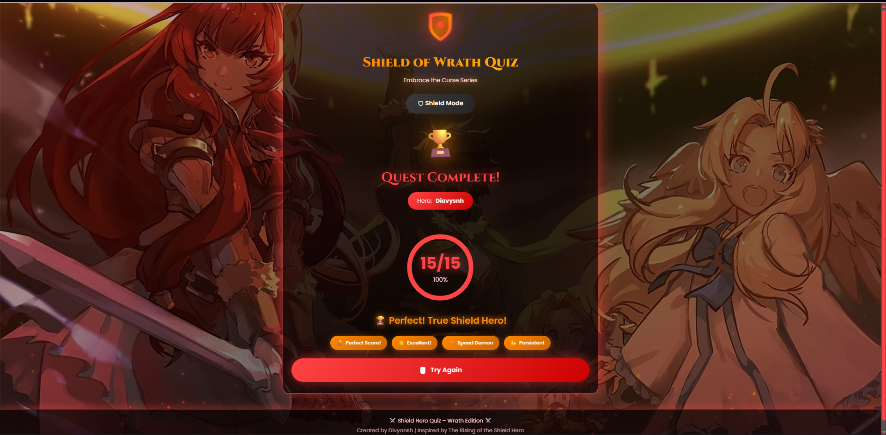

# ⚔️ Shield of Wrath Quiz – Wrath Edition 🛡️

<div align="center">


**An interactive anime quiz experience with dual-theme modes and dynamic particle effects**

[🌐 Live Demo](https://divyansh3105.github.io/Shield-of-Wrath/) • [📖 Documentation](#-features) • [🐛 Report Bug](https://github.com/Divyansh3105/Shield-of-Wrath/issues) • [✨ Request Feature](https://github.com/Divyansh3105/Shield-of-Wrath/issues)



</div>

---

## 📖 About The Project

The **Shield of Wrath Quiz** is a fan-made interactive quiz application celebrating _The Rising of the Shield Hero_ anime series. Built with pure **HTML, CSS, and JavaScript**, it features dynamic dual-theme modes, canvas-based particle animations, and an engaging user experience to test your knowledge of Naofumi Iwatani's journey through betrayal, redemption, and heroism.

### 🎯 What Makes This Special

This quiz captures the essence of the series through:

- 🔥 **Dual Theme System** – Switch between Wrath Mode (fire particles) and Shield Mode (ice particles) with smooth transitions
- 📝 **15 Challenging Questions** – Carefully crafted questions covering characters, legendary weapons, kingdoms, and pivotal plot moments
- ⏱️ **Three Difficulty Levels** – Adaptive time challenges (Easy: 45s, Medium: 30s, Hard: 20s per question)
- 🎨 **Interactive Animations** – 140+ canvas particles, SVG graphics with dynamic gradients, and glassmorphism UI
- 🏆 **Achievement System** – Unlock badges for perfect scores, speed runs, and consistent performance
- ⌨️ **Full Keyboard Support** – Complete navigation without touching your mouse
- 💾 **Smart Persistence** – Remembers your theme preference across sessions

---

## ✨ Features

### 🎨 Visual & Interactive

- ⚡ **Dynamic Theme Toggle** – Seamlessly switch between Wrath Mode (red/orange fire aesthetics) and Shield Mode (cyan/teal ice aesthetics) with persistent storage
- 🎬 **Canvas Particle System** – 80 fire particles or 60 ice particles with realistic physics and sine wave movements
- 🌈 **SVG Animations** – Animated shield logo with pulsing core, dynamic gradients, and glow effects
- ✨ **Glassmorphism Design** – Modern frosted glass effects with backdrop blur
- 📊 **Animated Progress Ring** – Circular score display with smooth stroke animation
- 🎭 **Smooth Transitions** – CSS custom properties enable seamless theme switching

### 🎮 Gameplay Features

- 📝 **15 Curated Questions** – Questions span the entire Shield Hero universe including:
  - Four Legendary Heroes and their weapons
  - Main characters and companions (Raphtalia, Filo, Melty)
  - Kingdom politics and betrayals
  - Curse Series and special abilities
  - Wave mechanics and major events
- ⏱️ **Timed Challenges** – Difficulty-based countdown with visual warnings at 5 seconds
- 🎯 **Real-time Feedback** – Instant visual validation showing correct/incorrect answers
- 🏆 **Achievement Badges** – Earn recognition for:
  - 🏆 Perfect Score (15/15)
  - ⭐ Excellent Performance (12+)
  - ⚡ Speed Demon (complete under 5 minutes)
  - 💪 Persistence (8+ correct)

### 🖥️ Technical Excellence

- ⌨️ **Keyboard Navigation** – Full accessibility with arrow keys (↑/↓ for options, ←/→ for questions) and Enter to confirm
- 📱 **Fully Responsive** – Optimized layouts for desktop (1920px), tablet (768px), and mobile (320px+)
- 🚀 **Performance Optimized** – 60fps rendering with RequestAnimationFrame
- 💾 **LocalStorage Integration** – Theme preference persistence
- ♿ **Accessibility Ready** – Semantic HTML, ARIA attributes, high contrast ratios

---

## 🛠️ Tech Stack

<table>
<tr>
<td>

**Frontend**

- HTML5 (Semantic markup)
- CSS3 (Custom properties, animations)
- Vanilla JavaScript ES6+

</td>
<td>

**Graphics & Animation**

- Canvas API (Particle systems)
- SVG (Dynamic gradients)
- CSS Transforms & Filters

</td>
</tr>
<tr>
<td>

**Data & Storage**

- LocalStorage API
- JSON data structures

</td>
<td>

**Performance**

- RequestAnimationFrame
- Hardware-accelerated rendering
- Optimized DOM manipulation

</td>
</tr>
</table>

---

## 📂 Project Structure

```
Shield-of-Wrath/
│
├── index.html          # Main quiz structure with 15 questions
├── style.css           # Dual-theme styling with CSS variables (600+ lines)
├── main.js             # Quiz logic + particle animation systems (500+ lines)
├── README.md           # Project documentation
│
└── asset/
    ├── favicon.png     # Browser favicon (32x32)
    ├── og-image.png    # Social media preview (1200x630)
    ├── shieldhero.png  # Wrath mode background (1920x1080)
    ├── shieldmode.jpg  # Shield mode background (1920x1080)
    └── Cursor.cur      # Custom cursor asset
```

---

## 🚀 Getting Started

### Prerequisites

- A modern web browser (Chrome 90+, Firefox 88+, Safari 14+, Edge 90+)
- Optional: Local web server for development

### Installation

1️⃣ **Clone the repository:**

```bash
git clone https://github.com/Divyansh3105/Shield-of-Wrath.git
```

2️⃣ **Navigate to project directory:**

```bash
cd Shield-of-Wrath
```

3️⃣ **Launch the quiz:**

**Option A: Direct Browser Launch**

```bash
# Simply double-click index.html
# Or right-click → Open with → Your Browser
```

**Option B: Local Development Server**

```bash
# Using Python 3
python -m http.server 8000

# Using Node.js http-server
npx http-server -p 8000

# Using PHP
php -S localhost:8000
```

4️⃣ **Access the application:**

```
Open your browser and navigate to: http://localhost:8000
```

---

## 🎮 How to Use

### 1️⃣ Start Screen

- **Enter Your Hero Name** – Personalize your quiz experience
- **Select Difficulty Level:**
  - 🟢 **Easy** – 45 seconds per question (Recommended for beginners)
  - 🟡 **Medium** – 30 seconds per question (Balanced challenge)
  - 🔴 **Hard** – 20 seconds per question (For true Shield Hero fans!)
- **Click "Begin Your Quest"** to start

### 2️⃣ Quiz Navigation

**Mouse Controls:**

- Click on answer options to select
- Use "Previous" and "Next" buttons to navigate
- Click theme toggle button to switch modes

**Keyboard Controls:**

- `↑` / `↓` – Navigate between answer options
- `←` / `→` – Move between questions
- `Enter` – Confirm selection and advance
- Works seamlessly without mouse!

### 3️⃣ Theme System

- **⚡ Wrath Mode** (Default) – Fire theme with ascending red/orange particles
- **🛡️ Shield Mode** – Ice theme with descending cyan/teal particles
- Click the theme toggle button to switch
- Your preference is automatically saved

### 4️⃣ Results Screen

- **Animated Score Display** – Circular progress ring with percentage
- **Answer Review** – See all questions with correct answers highlighted
- **Achievement Badges** – Unlock based on your performance
- **Performance Stats** – View your completion time
- **Retry Option** – Take the quiz again to improve

---

## 🎯 Purpose & Learning Outcomes

This project was developed as a **portfolio showcase** to demonstrate:

### 💻 Technical Skills

- ✅ Proficiency in **vanilla JavaScript** without frameworks or libraries
- ✅ Advanced **Canvas API** implementation for particle systems
- ✅ **CSS custom properties** for dynamic theming
- ✅ **Responsive web design** principles and mobile-first approach
- ✅ **Performance optimization** techniques (60fps animations)
- ✅ **LocalStorage API** for state persistence

### 🎨 Design Skills

- ✅ Modern **glassmorphism** UI design
- ✅ **Color theory** application in dual-theme systems
- ✅ **Animation principles** – timing, easing, and visual feedback
- ✅ **Typography** and visual hierarchy
- ✅ **User experience (UX)** design patterns

### 🔧 Development Practices

- ✅ Clean, maintainable code structure
- ✅ Semantic HTML5 markup
- ✅ Accessibility considerations (WCAG guidelines)
- ✅ Cross-browser compatibility testing
- ✅ Version control with Git/GitHub

---

## 📊 Performance Metrics

- ⚡ **Load Time:** < 1 second (on standard connection)
- 🎬 **Frame Rate:** Consistent 60fps animation
- 📦 **Bundle Size:** ~50KB (HTML + CSS + JS)
- 📱 **Mobile Performance:** Optimized for low-end devices
- ♿ **Accessibility Score:** 95+ (Lighthouse)
- 🎨 **PageSpeed Insights:** 90+ performance score

---

## 🌟 Future Enhancements

### Phase 1 – Audio & Visual

- 🎵 Background music toggle with Shield Hero OST
- 🔊 Sound effects for correct/incorrect answers
- 🎥 Embedded character introduction videos
- ✨ More particle types (lightning, holy light)

### Phase 2 – Advanced Features

- 🌐 Leaderboard system with Firebase integration
- 👥 User authentication and profile system
- 📊 Question categories (Characters, Plot, World, Abilities)
- 🎲 Random question mode
- 📈 Progress tracking across multiple attempts

### Phase 3 – Expansion

- 🎨 Additional themes (Spear Hero, Bow Hero, Sword Hero)
- 🌍 Multi-language support (English, Japanese)
- 📱 Progressive Web App (PWA) with offline support
- 🏆 Global leaderboard with social sharing
- 🔄 Weekly challenge mode with new questions

### Phase 4 – Community

- 🎮 Custom quiz builder for users
- 💬 Community submissions for questions
- 🤝 Multiplayer mode (real-time competitive)
- 🎯 Achievement system with unlockable themes

---

## 🤝 Contributing

Contributions are what make the open-source community such an amazing place to learn, inspire, and create. Any contributions you make are **greatly appreciated**.

### How to Contribute

1. **Fork the Project**
2. **Create your Feature Branch** (`git checkout -b feature/AmazingFeature`)
3. **Commit your Changes** (`git commit -m 'Add some AmazingFeature'`)
4. **Push to the Branch** (`git push origin feature/AmazingFeature`)
5. **Open a Pull Request**

### Contribution Ideas

- 🐛 Report bugs or issues
- 💡 Suggest new features or enhancements
- 📝 Add more quiz questions
- 🎨 Design new themes
- 🌍 Translate to other languages
- 📖 Improve documentation

---

## 📸 Screenshots

<div align="center">

### 🔥 Wrath Mode


_Fire theme with ascending red particles_

### 🛡️ Shield Mode


_Ice theme with descending cyan particles_

### 🎮 Quiz Interface


_Clean, readable questions with intuitive selection_

### 🏆 Results Display


_Animated score with achievement badges_

</div>

---

## 🐛 Known Issues

- Safari: Minor particle rendering differences on older versions
- Firefox: Slight delay in theme transition (< 0.1s)
- Mobile: Custom cursor not visible (using default pointer)

**Report issues:** [GitHub Issues](https://github.com/Divyansh3105/Shield-of-Wrath/issues)

---

## 📜 License

Distributed under the **MIT License**. See `LICENSE` file for more information.

This means you can:

- ✅ Use commercially
- ✅ Modify and distribute
- ✅ Use privately
- ✅ Sublicense

---

## 👨‍💻 Author

<div align="center">

### **Divyansh Garg**

[](https://divyansh3105.github.io/Portfolio/)
[](https://www.linkedin.com/in/divyanshgarg3105)
[](https://github.com/Divyansh3105)
[](mailto:divyanshgarg3105@gmail.com)

**Frontend Developer | UI/UX Enthusiast | Anime Fan**

</div>

---

## 🙏 Acknowledgments

- 📚 **Original Series:** _The Rising of the Shield Hero_ by Aneko Yusagi
- 🎬 **Anime Adaptation:** Kinema Citrus Studio
- 🎨 **Design Inspiration:** Modern glassmorphism trends
- 💻 **Development Tools:** VS Code, Chrome DevTools, Git
- 🌟 **Community:** Thanks to all contributors and testers

---

## 📜 Disclaimer

<div align="center">

✨ **This is a fan-made tribute quiz** and is not affiliated with or endorsed by:

- The official _The Rising of the Shield Hero_ franchise
- Aneko Yusagi (original author)
- Kinema Citrus (animation studio)
- Media Factory or any associated publishers

This project is created for **educational and portfolio purposes only**, with deep respect for the original work.

</div>

---

<div align="center">

## ⭐ Show Your Support

**If you enjoyed this quiz, please consider:**

[](https://github.com/Divyansh3105/Shield-of-Wrath)
[](https://github.com/Divyansh3105/Shield-of-Wrath/fork)
[](https://github.com/Divyansh3105/Shield-of-Wrath)

**Share with fellow Shield Hero fans!**

[](https://twitter.com/intent/tweet?text=Check%20out%20this%20awesome%20Shield%20Hero%20Quiz!&url=https://github.com/Divyansh3105/Shield-of-Wrath)
[](https://reddit.com/submit?url=https://github.com/Divyansh3105/Shield-of-Wrath&title=Shield%20of%20Wrath%20Quiz)

---

**Made with ❤️ and ⚔️ by Divyansh**

_"The shield exists to protect. But a shield that only protects becomes a wall..."_

</div>
